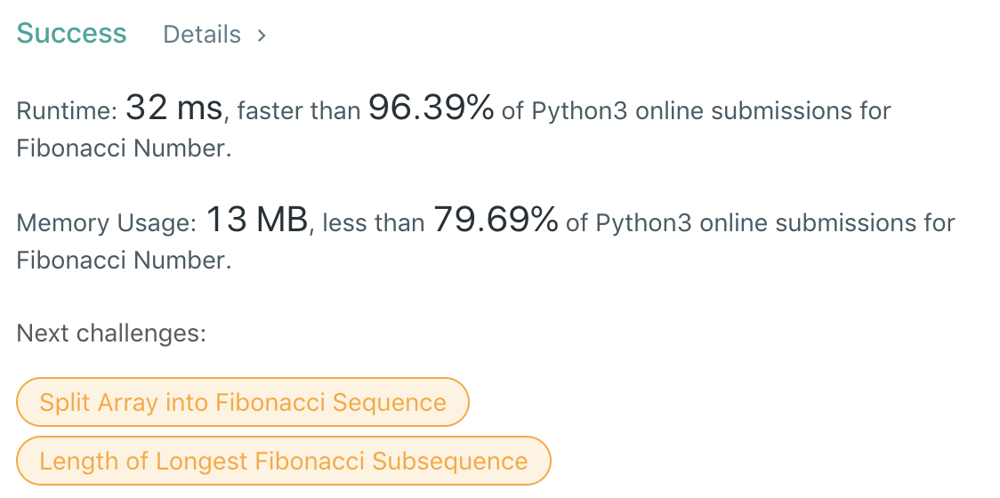

# 2. Fibonacci Number


```text
class Solution:
    def fib(self, N: int) -> int:
        group = [0, 1]
        for i in range(2, N + 1):
            group.append(group[-1] + group[-2])
        return group[N]
```



