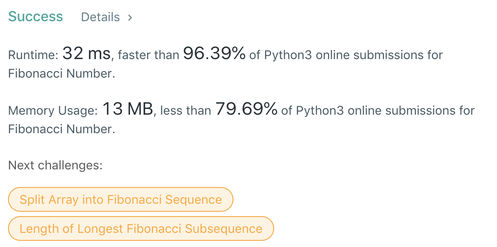

# 1. Minimum Path Sum



```text
class Solution:
    def minPathSum(self, grid: List[List[int]]) -> int:
        space = [[None for sublst in lst] for lst in grid]
        n = len(grid)
        m = len(grid[0])
        space[0][0] = grid[0][0]
        for k in range(1, m):
            space[0][k] = grid[0][k] + space[0][k-1]
        for h in range(1, n):
            space[h][0] = grid[h][0] + space[h-1][0]
        for i in range(1, n):
            for j in range(1, m):
                space[i][j] = min(space[i][j-1], space[i-1][j]) + grid[i][j]
        return space[-1][-1]
```


